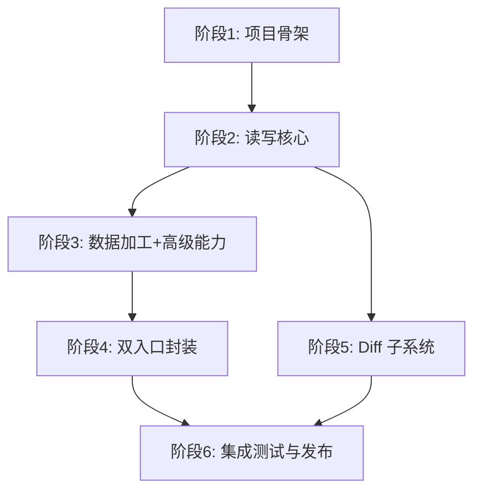

# 实施计划总览

本文档将项目拆分为 **6 个阶段**，按依赖关系递进实施。每个阶段产出可独立验证的成果。

## 项目概览

| 维度 | 内容 |
|------|------|
| 项目名 | Excel Tool Gateway |
| 定位 | Rust 轻量化 Excel 原子操作网关，CLI + HTTP 双入口，为 AI Agent 提供标准化 Excel 操作能力 |
| 核心依赖 | `calamine` (只读) + `rust_xlsxwriter` (只写) |
| 附属项目 | `excel-diff` — Python 实现的 Git + Excel 智能 diff 工具 |
| 架构原则 | 扁平两层架构，无 DDD/领域层；原子操作一一对应函数/命令/接口；所有写操作强制安全前置 |

## 阶段依赖关系

- **P1~P4**: 主项目 `excel-tool-gateway`（Rust）
- **P5**: 附属项目 `excel-diff`（Python）
- **P6**: 统一集成、测试与发布
