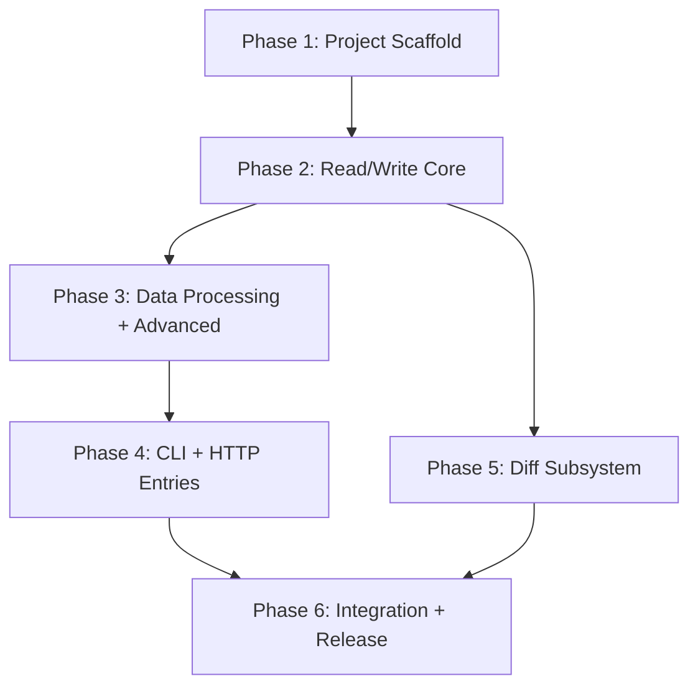

# Implementation Plan Overview

This document organizes the project into **6 phases**, executed sequentially by dependency. Each phase produces independently verifiable deliverables.

## Project Overview

| Dimension | Content |
|-----------|---------|
| Name | Excel Tool Gateway |
| Type | Rust Cargo Workspace (monorepo) |
| Target | AI Agent Excel operations — CLI + HTTP gateway |
| Core Dependencies | `calamine` (read-only) + `rust_xlsxwriter` (write-only) |
| Architecture | Flat two-layer (entry → core); workspace-level modularity with `excel-core`, `excel-diff`, `excel-cli`, `excel-http` crates |
| Language | Rust only |

## Project Structure

The project uses a Cargo workspace layout with independent crates:

```
excel-tool-gateway/
├── Cargo.toml                    # [workspace] manifest
└── crates/
    ├── excel-core/              # Core engine (read/write/data/security/vba)
    ├── excel-diff/              # Diff engine (depends on excel-core read)
    ├── excel-cli/               # CLI binary (depends on core + diff)
    └── excel-http/              # HTTP binary (depends on core + diff)
```

Key design principles:
- **Core engine下沉**: All Excel operations live in `excel-core`. Entry crates depend on it, never the reverse.
- **Diff独立可扩展**: `excel-diff` depends only on `excel-core`'s read types, keeping it reusable as a git diff driver or web UI diff backend.
- **双入口上浮**: `excel-cli` and `excel-http` are independent binaries, sharing only `excel-core`.

## Phase Dependencies



- **P1–P4**: `excel-core`, `excel-cli`, `excel-http`
- **P5**: `excel-diff`
- **P6**: Integration, CI/CD, documentation, release

## Technology Stack

| Layer | Technology |
|-------|-----------|
| Excel read | `calamine` 0.31 |
| Excel write | `rust_xlsxwriter` 0.50 |
| CLI parsing | `clap` 4 |
| HTTP framework | `axum` 0.7 + `tokio` |
| Serialization | `serde` + `serde_json` |
| Security | `sha2`, `chrono` |