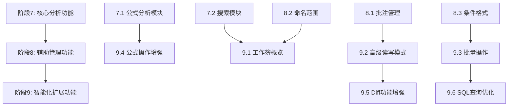

# 缺失功能实施计划

根据 `docs/excel-pi-ref` 参考文档与当前实现的对比分析，本文档规划缺失功能的实施路线图。

## 实施进度

- [x] 阶段7: 核心分析功能 - 已完成基础实现
  - [x] 7.1 公式分析模块
  - [x] 7.2 搜索模块
- [x] 阶段8: 辅助管理功能 - 已完成基础实现
  - [x] 8.1 批注管理模块
  - [x] 8.2 命名范围管理模块
  - [x] 8.3 条件格式设置模块
- [ ] 阶段9: 智能化和扩展功能 - 待实现

## 已完成功能

### 阶段7: 核心分析功能

#### 7.1 公式分析模块
- **trace_dependencies**: 单元格依赖关系追踪（前驱/后继单元格）
- **explain_formula**: 公式逻辑解释（支持中英文）
- **explain_formula_logic**: 深度公式逻辑分析
- HTTP API 端点: `/api/formula/trace_dependencies`, `/api/formula/explain`, `/api/formula/explain_logic`

#### 7.2 搜索模块
- **search_workbook**: 全工作簿内容搜索
- **search_sheet**: 指定工作表搜索
- 支持值、公式、正则表达式搜索
- 支持大小写敏感/不敏感
- 返回匹配单元格的上下文
- HTTP API 端点: `/api/search/workbook`, `/api/search/sheet`

### 阶段8: 辅助管理功能

#### 8.1 批注管理模块
- **get_comment**: 读取单元格批注
- **add_comment**: 添加单元格批注
- **update_comment**: 修改单元格批注
- **delete_comment**: 删除单元格批注
- HTTP API 端点: `/api/comments/get`, `/api/comments/add`, `/api/comments/update`, `/api/comments/delete`

#### 8.2 命名范围管理模块
- **list_named_ranges**: 列出所有命名范围
- **get_named_range_value**: 获取命名范围的值
- **create_named_range**: 创建命名范围
- **delete_named_range**: 删除命名范围
- HTTP API 端点: `/api/named_ranges/list/{path}`, `/api/named_ranges/get_value`, `/api/named_ranges/create`, `/api/named_ranges/delete`

#### 8.3 条件格式设置模块
- **add_conditional_format**: 添加条件格式
- **remove_conditional_format**: 删除条件格式
- 支持多种条件类型（CellValue, Formula等）
- HTTP API 端点: `/api/conditional_format/add`, `/api/conditional_format/remove`

## 待实现功能（阶段9）

### 9.1 工作簿概览和历史管理
- **get_workbook_overview**: 工作簿结构概览API
- **workbook_history**: 操作历史记录和备份恢复
- 工作簿蓝图（结构元数据）

### 9.2 高级读写模式增强
- read_range 支持三种输出模式（compact/csv/detailed）
- 输出截断策略
- 上下文窗口自动扩展
- 自动读取选择区域上下文

### 9.3 批量操作和安全机制
- 系统化的批量修改API
- 输出截断和性能优化机制
- 覆盖保护机制
- 公式验证和引用验证
- 执行策略分类

### 9.4 公式操作增强
- **fill_formula**: 公式自动填充功能
- 公式依赖分析和验证

### 9.5 Diff功能增强
- 语义化Diff（natural language generation）
- 公式依赖追踪Diff
- 批量Diff优化

### 9.6 SQL查询深度
- 复杂查询优化
- 多表关联查询
- 查询结果缓存

## 新增文件清单

### crates/excel-core
- `src/formula_analysis.rs` - 公式分析模块
- `src/search.rs` - 搜索模块
- `src/comments.rs` - 批注管理模块
- `src/named_ranges.rs` - 命名范围管理模块
- `src/conditional_format.rs` - 条件格式设置模块

### crates/excel-http
- `src/http/formula_analysis.rs` - 公式分析HTTP API
- `src/http/search.rs` - 搜索HTTP API
- `src/http/comments.rs` - 批注管理HTTP API
- `src/http/named_ranges.rs` - 命名范围HTTP API
- `src/http/conditional_format.rs` - 条件格式HTTP API

### docs/plan
- `phase7-9-missing-features.md` - 本文档

## 依赖更新

### crates/excel-core/Cargo.toml
新增依赖:
- `regex = "1.11"` - 正则表达式支持
- `zip = "2.2"` - ZIP文件解析（用于批注读取）

## 技术要点

### 公式依赖追踪
- 使用正则表达式解析公式中的单元格引用
- 递归追踪前驱和后继单元格
- 支持跨工作表引用

### 搜索功能
- 支持值、公式、正则表达式三种搜索模式
- 返回匹配单元格的上下文信息
- 跨工作表搜索支持

### 批注管理
- 通过解析 `xl/worksheets/_rels/{sheet}.xml.rels` 读取批注
- 使用 `rust_xlsxwriter` 写入批注

### 命名范围管理
- 通过解析 `xl/workbook.xml` 读取命名范围
- 支持创建和删除命名范围

### 条件格式
- 使用 `rust_xlsxwriter` 的条件格式API
- 支持多种条件类型

## 测试建议

1. **公式分析功能测试**:
   - 创建包含公式的Excel文件
   - 测试依赖追踪、公式解释、逻辑分析
   - 验证中英文支持

2. **搜索功能测试**:
   - 测试值搜索、公式搜索、正则表达式搜索
   - 验证上下文返回

3. **批注管理测试**:
   - 测试批注的增删改查
   - 验证跨工作表批注

4. **命名范围测试**:
   - 测试命名范围的创建、删除、查询
   - 验证跨工作表引用

5. **条件格式测试**:
   - 测试条件格式的添加和删除
   - 验证不同条件类型

## 已知限制

1. **批注读取**: 使用XML解析，可能不覆盖所有Excel版本
2. **条件格式**: 仅支持部分条件类型
3. **公式分析**: 不支持所有Excel函数的详细解释

## 下一步计划

1. 在Rust环境中编译并测试所有新功能
2. 完善错误处理和边界情况
3. 添加单元测试
4. 实现阶段9的智能化和扩展功能

## 缺失功能清单

### P0: 核心分析功能（最高优先级）

#### 1.1 公式分析工具
- **trace_dependencies**: 单元格依赖关系追踪（前驱/后继单元格）
- **explain_formula**: 公式逻辑解释
- **explain_formula_logic**: 深度公式逻辑分析

#### 1.2 搜索功能
- **search_workbook**: 全工作簿内容搜索
  - 支持值、公式、正则表达式搜索
  - 支持跨工作表搜索
  - 返回匹配单元格位置和上下文

### P1: 辅助管理功能（高优先级）

#### 2.1 批注管理
- 读取单元格批注
- 添加、修改、删除批注
- 批注内容解析和格式化

#### 2.2 命名范围管理
- 列出所有命名范围
- 获取命名范围的值
- 创建、删除命名范围

#### 2.3 条件格式设置
- 设置条件格式规则
- 支持多种条件类型
- 条件格式样式定义

### P2: 智能化和扩展功能（中优先级）

#### 3.1 工作簿概览和历史管理
- **get_workbook_overview**: 工作簿结构概览API
- **workbook_history**: 操作历史记录和备份恢复
- 工作簿蓝图（结构元数据）

#### 3.2 高级读写模式和上下文感知
- read_range 支持三种输出模式（compact/csv/detailed）
- 输出截断策略
- 上下文窗口自动扩展
- 自动读取选择区域上下文

#### 3.3 批量操作和安全机制
- 系统化的批量修改API
- 输出截断和性能优化机制
- 覆盖保护机制
- 公式验证和引用验证
- 执行策略分类

#### 3.4 公式操作增强
- **fill_formula**: 公式自动填充功能
- 公式依赖分析和验证

#### 3.5 Diff功能增强
- 语义化Diff（natural language generation）
- 公式依赖追踪Diff
- 批量Diff优化

#### 3.6 SQL查询深度
- 复杂查询优化
- 多表关联查询
- 查询结果缓存

## 实施阶段划分

### 阶段7: 核心分析功能（P0）

#### 7.1 公式分析模块（formula_analysis.rs）
**目标**: 实现公式依赖追踪和解释功能

**新增文件**:
- `crates/excel-core/src/formula_analysis.rs`
- `crates/excel-http/src/http/formula_analysis.rs`

**核心功能**:
```rust
// formula_analysis.rs
pub fn trace_dependencies(
    path: &str,
    sheet: &str,
    cell: &str
) -> Result<DependencyTrace>

pub fn explain_formula(
    path: &str,
    sheet: &str,
    cell: &str
) -> Result<FormulaExplanation>

pub fn explain_formula_logic(
    path: &str,
    sheet: &str,
    cell: &str
) -> Result<FormulaLogicExplanation>
```

**数据结构**:
```rust
pub struct DependencyTrace {
    pub cell: CellRef,
    pub direct_precedents: Vec<CellRef>,
    pub direct_dependents: Vec<CellRef>,
    pub all_precedents: Vec<CellRef>,
    pub all_dependents: Vec<CellRef>,
}

pub struct FormulaExplanation {
    pub cell: CellRef,
    pub formula: String,
    pub function_name: Option<String>,
    pub arguments: Vec<String>,
    pub description: String,
    pub language: String,
}

pub struct FormulaLogicExplanation {
    pub cell: CellRef,
    pub formula: String,
    pub logic_flow: Vec<LogicStep>,
    pub data_sources: Vec<CellRef>,
    pub calculation_result: Option<String>,
}
```

**实现要点**:
- 解析公式字符串，提取引用的单元格
- 递归追踪依赖关系（前驱和后继）
- 支持跨工作表引用追踪
- 生成公式逻辑的自然语言解释

#### 7.2 搜索模块（search.rs）
**目标**: 实现全工作簿搜索功能

**新增文件**:
- `crates/excel-core/src/search.rs`
- `crates/excel-http/src/http/search.rs`

**核心功能**:
```rust
// search.rs
pub fn search_workbook(
    path: &str,
    query: &SearchQuery
) -> Result<SearchResults>

pub fn search_sheet(
    path: &str,
    sheet: &str,
    query: &SearchQuery
) -> Result<SearchResults>
```

**数据结构**:
```rust
pub struct SearchQuery {
    pub pattern: String,
    pub search_type: SearchType, // Value, Formula, Both
    pub match_type: MatchType,   // Exact, Contains, Regex
    pub case_sensitive: bool,
    pub sheets: Option<Vec<String>>,
}

pub struct SearchResults {
    pub query: String,
    pub matches: Vec<SearchMatch>,
    pub total_matches: usize,
}

pub struct SearchMatch {
    pub sheet: String,
    pub cell: String,
    pub value: Option<String>,
    pub formula: Option<String>,
    pub context: Option<Vec<Vec<String>>>,
}
```

**实现要点**:
- 支持值和公式的分别搜索
- 支持正则表达式匹配
- 返回匹配单元格的上下文（周围单元格）
- 跨工作表搜索

### 阶段8: 辅助管理功能（P1）

#### 8.1 批注管理模块（comments.rs）
**目标**: 实现单元格批注的读写功能

**新增文件**:
- `crates/excel-core/src/comments.rs`
- `crates/excel-http/src/http/comments.rs`

**核心功能**:
```rust
// comments.rs
pub fn get_comment(
    path: &str,
    sheet: &str,
    cell: &str
) -> Result<Option<Comment>>

pub fn add_comment(
    path: &str,
    sheet: &str,
    cell: &str,
    comment: &str,
    params: &SecurityParams
) -> Result<WriteResult>

pub fn update_comment(
    path: &str,
    sheet: &str,
    cell: &str,
    comment: &str,
    params: &SecurityParams
) -> Result<WriteResult>

pub fn delete_comment(
    path: &str,
    sheet: &str,
    cell: &str,
    params: &SecurityParams
) -> Result<WriteResult>
```

**数据结构**:
```rust
pub struct Comment {
    pub author: Option<String>,
    pub text: String,
    pub created_at: Option<DateTime<Utc>>,
}
```

**实现要点**:
- 使用 `rust_xlsxwriter` 的 `add_comment()` API
- 支持批注的增删改查
- 读取时使用 `calamine` 解析

#### 8.2 命名范围管理模块（named_ranges.rs）
**目标**: 实现命名范围的管理功能

**新增文件**:
- `crates/excel-core/src/named_ranges.rs`
- `crates/excel-http/src/http/named_ranges.rs`

**核心功能**:
```rust
// named_ranges.rs
pub fn list_named_ranges(path: &str) -> Result<Vec<NamedRange>>

pub fn get_named_range_value(
    path: &str,
    name: &str
) -> Result<Option<Vec<Vec<CellData>>>>

pub fn create_named_range(
    path: &str,
    name: &str,
    range: &str,
    sheet: Option<&str>,
    params: &SecurityParams
) -> Result<WriteResult>

pub fn delete_named_range(
    path: &str,
    name: &str,
    params: &SecurityParams
) -> Result<WriteResult>
```

**数据结构**:
```rust
pub struct NamedRange {
    pub name: String,
    pub refers_to: String,
    pub sheet: Option<String>,
    pub comment: Option<String>,
}
```

**实现要点**:
- 读取时解析工作簿的已定义名称
- 创建时使用 `rust_xlsxwriter` 的 `define_name()` API
- 删除时重新写入工作簿（不包含指定名称）

#### 8.3 条件格式设置模块（conditional_format.rs）
**目标**: 实现条件格式的设置功能

**新增文件**:
- `crates/excel-core/src/conditional_format.rs`
- `crates/excel-http/src/http/conditional_format.rs`

**核心功能**:
```rust
// conditional_format.rs
pub fn add_conditional_format(
    path: &str,
    sheet: &str,
    range: &str,
    rule: &ConditionalFormatRule,
    params: &SecurityParams
) -> Result<WriteResult>

pub fn remove_conditional_format(
    path: &str,
    sheet: &str,
    range: &str,
    params: &SecurityParams
) -> Result<WriteResult>
```

**数据结构**:
```rust
pub struct ConditionalFormatRule {
    pub rule_type: ConditionalFormatType,
    pub condition: String,
    pub format: Option<Format>,
}

pub enum ConditionalFormatType {
    CellValue,
    Formula,
    AboveAverage,
    Top10,
    Duplicate,
    // ...
}
```

**实现要点**:
- 使用 `rust_xlsxwriter` 的 `conditional_format()` API
- 支持多种条件类型
- 支持自定义格式样式

### 阶段9: 智能化和扩展功能（P2）

#### 9.1 工作簿概览和历史管理（workbook_overview.rs）
**目标**: 实现工作簿结构概览和操作历史

**新增文件**:
- `crates/excel-core/src/workbook_overview.rs`
- `crates/excel-http/src/http/workbook_overview.rs`

**核心功能**:
```rust
// workbook_overview.rs
pub fn get_workbook_overview(path: &str) -> Result<WorkbookOverview>

pub fn get_workbook_blueprint(path: &str) -> Result<WorkbookBlueprint>
```

**数据结构**:
```rust
pub struct WorkbookOverview {
    pub path: String,
    pub sheets: Vec<SheetOverview>,
    pub named_ranges: Vec<NamedRange>,
    pub total_cells: usize,
    pub formula_cells: usize,
}

pub struct SheetOverview {
    pub name: String,
    pub used_range: String,
    pub row_count: usize,
    pub col_count: usize,
    pub has_formulas: bool,
    pub has_data: bool,
}

pub struct WorkbookBlueprint {
    pub structure: WorkbookStructure,
    pub data_flows: Vec<DataFlow>,
    pub key_cells: Vec<KeyCell>,
}
```

#### 9.2 高级读写模式增强
**目标**: 增强 `read_range` 支持多种输出模式

**修改文件**:
- `crates/excel-core/src/excel_read.rs`
- `crates/excel-http/src/http/cell.rs`

**新增功能**:
```rust
pub fn read_range_advanced(
    path: &str,
    sheet: &str,
    range_spec: &str,
    options: &ReadRangeOptions
) -> Result<ReadRangeResult>
```

**数据结构**:
```rust
pub struct ReadRangeOptions {
    pub mode: OutputMode,      // Compact, Csv, Detailed
    pub truncate: Option<usize>,
    pub include_context: bool,
    pub context_size: usize,
}

pub enum OutputMode {
    Compact,
    Csv,
    Detailed,
}
```

#### 9.3 批量操作和安全机制（batch_operations.rs）
**目标**: 实现系统化的批量修改API和安全验证

**新增文件**:
- `crates/excel-core/src/batch_operations.rs`
- `crates/excel-http/src/http/batch.rs`

**核心功能**:
```rust
// batch_operations.rs
pub fn batch_modify(
    path: &str,
    operations: Vec<BatchOperation>,
    params: &SecurityParams
) -> Result<BatchResult>

pub fn validate_formula_references(
    path: &str,
    sheet: &str,
    formula: &str
) -> Result<ValidationResult>
```

#### 9.4 公式操作增强（formula_ops.rs）
**目标**: 实现公式自动填充和依赖验证

**新增文件**:
- `crates/excel-core/src/formula_ops.rs`
- `crates/excel-http/src/http/formula_ops.rs`

**核心功能**:
```rust
// formula_ops.rs
pub fn fill_formula(
    path: &str,
    sheet: &str,
    source: &str,
    target_range: &str,
    params: &SecurityParams
) -> Result<WriteResult>
```

#### 9.5 Diff功能增强
**目标**: 增强Diff功能，支持语义化输出和公式追踪

**修改文件**:
- `crates/excel-diff/src/lib.rs`
- `crates/excel-http/src/http/diff.rs`

**新增功能**:
```rust
// excel-diff
pub fn diff_with_semantic(
    old_path: &str,
    new_path: &str,
    options: &DiffOptions
) -> Result<SemanticDiff>

pub fn diff_formula_dependencies(
    old_path: &str,
    new_path: &str,
    sheet: &str
) -> Result<FormulaDependencyDiff>
```

#### 9.6 SQL查询深度优化
**目标**: 优化SQL查询能力，支持复杂查询和缓存

**修改文件**:
- `crates/excel-sql/src/lib.rs`
- `crates/excel-http/src/http/data.rs`

**新增功能**:
```rust
// excel-sql
pub fn sql_query_advanced(
    path: &str,
    sheet: &str,
    sql: &str,
    params: &QueryParams
) -> Result<QueryResult>

pub fn query_with_cache(
    path: &str,
    sql: &str,
    cache_key: Option<&str>
) -> Result<QueryResult>
```

## HTTP API 端点设计

### 阶段7: 核心分析功能

```
POST /api/formula/trace_dependencies
POST /api/formula/explain
POST /api/formula/explain_logic

POST /api/search/workbook
POST /api/search/sheet
```

### 阶段8: 辅助管理功能

```
GET /api/comments/get
POST /api/comments/add
POST /api/comments/update
POST /api/comments/delete

GET /api/named_ranges/list
GET /api/named_ranges/get_value
POST /api/named_ranges/create
POST /api/named_ranges/delete

POST /api/conditional_format/add
POST /api/conditional_format/remove
```

### 阶段9: 智能化和扩展功能

```
GET /api/workbook/overview
GET /api/workbook/blueprint

POST /api/batch/modify
POST /api/batch/validate_formula

POST /api/formula/fill

POST /api/diff/semantic
POST /api/diff/formula_dependencies

POST /api/data/query_advanced
POST /api/data/query_with_cache
```

## 实施顺序和依赖关系



## 验证标准

### 阶段7: 核心分析功能
- [ ] trace_dependencies 正确追踪前驱和后继单元格
- [ ] explain_formula 生成准确的公式解释
- [ ] search_workbook 支持值、公式、正则表达式搜索
- [ ] 搜索结果包含正确的上下文信息

### 阶段8: 辅助管理功能
- [ ] 批注的增删改查功能正常
- [ ] 命名范围创建、删除、查询正确
- [ ] 条件格式设置正确应用

### 阶段9: 智能化和扩展功能
- [ ] 工作簿概览包含完整的结构信息
- [ ] 高级读取模式支持三种输出格式
- [ ] 批量操作支持原子性和回滚
- [ ] 公式填充功能正常工作
- [ ] 语义化Diff生成自然语言描述
- [ ] SQL查询优化提升性能

## 技术挑战和解决方案

### 1. 公式依赖追踪
**挑战**: 解析公式中的单元格引用
**解决方案**: 使用正则表达式或专用公式解析库

### 2. 批注读取
**挑战**: `calamine` 对批注的支持有限
**解决方案**: 使用 `zip` 直接解析 XML 文件

### 3. 命名范围读取
**挑战**: 需要解析工作簿的已定义名称
**解决方案**: 解析 `workbook.xml` 中的 `definedNames`

### 4. 语义化Diff
**挑战**: 生成自然语言描述
**解决方案**: 使用模板化文本生成

## 时间估算

- 阶段7: 核心分析功能 - 2-3天
- 阶段8: 辅助管理功能 - 2-3天
- 阶段9: 智能化和扩展功能 - 3-4天

总计: 7-10天